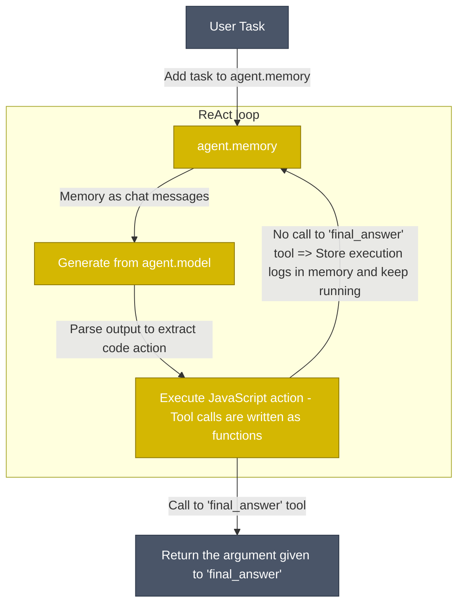

<p align="center">
    <a href="https://www.npmjs.com/package/smolagents.js"></a>
    <a href="https://github.com/yusuf-eren/smolagents.js"></a>
    <a href="https://www.npmjs.com/package/smolagents.js"></a>
</p>

<h3 align="center">
  <div style="display:flex;flex-direction:row;">
    
    
    
    <p>Agents that think in code - now in TypeScript!</p>
  </div>
</h3>

**smolagents.js** is a TypeScript/Node.js port of the popular Python `smolagents` library that enables you to run powerful AI agents in just a few lines of code. It brings the power of agentic workflows to the JavaScript ecosystem with:

- **Simplicity**: Clean TypeScript implementation with minimal abstractions above raw code
- **Type Safety**: Full TypeScript support with comprehensive type definitions  
- **Modern JavaScript**: Built for Node.js with ES modules and async/await patterns
- **Tool Creation**: Simple and intuitive tool definition system with Zod validation support
- **Schema Validation**: Built-in Zod support for tool parameters and agent output types
- **Model Flexibility**: Support for multiple LLM providers starting with OpenAI
- **Streaming Support**: Real-time agent responses with streaming capabilities

## Demo

See smolagents.js in action:


## Quick Start

First install the package:
```bash
npm install smolagents.js
```

Then define your agent, give it the tools it needs and run it!

```typescript
import { OpenAIServerModel, ToolCallingAgent, tool } from 'smolagents.js';

// Create a custom tool using the tool helper
const getWeatherTool = tool(
  {
    name: 'get_weather',
    description: 'Get the weather for a given city',
    inputs: {
      city: {
        type: 'string',
        description: 'The city to get the weather for',
      },
    },
    outputType: 'string',
  },
  async ({ city }: { city: string }): Promise<string> => {
    // In a real implementation, you'd call a weather API here
    return `The weather in ${city} is sunny with 72°F`;
  }
);

// Initialize your model
const model = new OpenAIServerModel({
  modelId: 'gpt-4o',
  apiKey: process.env.OPENAI_API_KEY,
});

// Create your agent with tools
const agent = new ToolCallingAgent({
  tools: [getWeatherTool],
  model,
  streamOutputs: true,
});

// Run your agent
const result = await agent.run('What is the weather in San Francisco?');
console.log(result);
```

## Implementation Status

### Agents
- [x] **MultiStepAgent** - Base agent class
- [x] **ToolCallingAgent** - JSON-based tool calling agent  
- [ ] **CodeAgent** - JavaScript code execution agent (in progress)

### Providers
- [x] **OpenAI** - Full OpenAI API support
- [ ] **TransformersModel** - Local model support
- [ ] **LiteLLMModel** - Access to 100+ LLMs
- [ ] **LiteLLMRouterModel** - LLM routing capabilities
- [ ] **VLLMModel** - vLLM inference server
- [ ] **AzureOpenAIServerModel** - Azure OpenAI integration
- [ ] **InferenceClientModel** - HuggingFace Inference API
- [ ] **AmazonBedrockServerModel** - AWS Bedrock support
- [ ] **MLXModel** - Apple MLX framework

### Built-in Tools
- [ ] **ApiWebSearchTool** - Web search via APIs
- [ ] **JavaScriptInterpreter** - Safe JS code execution
- [x] **FinalAnswerTool** - Return final results
- [x] **UserInputTool** - Interactive user input
- [ ] **WebSearchTool** - General web search
- [ ] **DuckDuckGoSearchTool** - Privacy-focused search
- [ ] **GoogleSearchTool** - Google search integration
- [ ] **VisitWebpageTool** - Web page content extraction
- [ ] **WikipediaSearchTool** - Wikipedia integration
- [ ] **SpeechToTextTool** - Audio transcription

## Usage Examples

### Creating Custom Tools

The `tool` helper function makes it easy to create custom tools with full TypeScript support:

```typescript
import { tool } from 'smolagents.js';

const calculateTool = tool(
  {
    name: 'calculate',
    description: 'Perform basic mathematical calculations',
    inputs: {
      expression: {
        type: 'string',
        description: 'Mathematical expression to evaluate (e.g., "2 + 2", "10 * 5")',
      },
    },
    outputType: 'number',
  },
  async ({ expression }: { expression: string }): Promise<number> => {
    // Simple calculator implementation
    return eval(expression); // Note: Use a safer math parser in production
  }
);
```

### Advanced Tool Creation with Zod Validation

For enhanced type safety and runtime validation, smolagents.js supports Zod schemas:

```typescript
import { tool } from 'smolagents.js';
import { z } from 'zod';

const userSchema = z.object({
  name: z.string().min(1),
  email: z.string().email(),
  age: z.number().int().min(0).max(120),
});

const createUserTool = tool(
  {
    name: 'create_user',
    description: 'Create a new user with validated data',
    inputs: {
      userData: {
        type: 'object',
        description: 'User data object',
        schema: userSchema, // Zod schema for runtime validation
      },
    },
    outputType: 'object',
  },
  async ({ userData }: { userData: z.infer<typeof userSchema> }) => {
    // userData is automatically validated and typed
    return {
      id: Math.random().toString(36),
      ...userData,
      createdAt: new Date().toISOString(),
    };
  }
);
```

### Advanced Agent Configuration

```typescript
import { ToolCallingAgent, OpenAIServerModel } from 'smolagents.js';

const model = new OpenAIServerModel({
  modelId: 'gpt-4o-mini',
  apiKey: process.env.OPENAI_API_KEY,
});

const agent = new ToolCallingAgent({
  tools: [calculateTool, getWeatherTool],
  model,
  maxSteps: 10,
  streamOutputs: true,
  instructions: 'You are a helpful assistant that can perform calculations and get weather information.',
});

const result = await agent.run("What's 15 * 24, and also tell me the weather in Tokyo?");
```

## Code Agents Architecture

The upcoming `CodeAgent` will work like classical ReAct agents but with a key difference: the LLM writes its actions as executable JavaScript/TypeScript code rather than structured JSON calls.



Actions are JavaScript/TypeScript code snippets. Tool calls are performed as function calls:

```javascript
// Agent can execute multiple operations in one action
const searchResults = [];
const queries = ["Node.js performance", "TypeScript optimization", "JavaScript V8 engine"];

for (const query of queries) {
    console.log(`Searching for: ${query}`);
    const result = await webSearch(query);
    searchResults.push(result);
}

console.log("Combined search results:", searchResults);
```

## Security Considerations

When working with agents that execute code, security is paramount. smolagents.js implements several safety measures:

- **Isolated Execution**: Code runs in controlled Node.js VM contexts
- **Input Sanitization**: All tool inputs undergo validation before execution  
- **Execution Limits**: Configurable timeouts and resource constraints
- **Future Enhancements**: Planned Docker and WebAssembly sandboxing options

## Installation

```bash
# Using npm
npm install smolagents.js

# Using yarn  
yarn add smolagents.js

# Using pnpm
pnpm add smolagents.js
```

## Development Setup

```bash
# Clone the repository
git clone https://github.com/yusuf-eren/smolagents.js
cd smolagents.js

# Install dependencies
pnpm install

# Build the project
pnpm build

# Run tests
pnpm test

# Try examples
pnpm run example:basic
```

## API Reference

### Core Classes

- **`ToolCallingAgent`** - Main agent class for tool-based workflows
- **`OpenAIServerModel`** - OpenAI model integration
- **`tool()`** - Helper function for creating custom tools

### Configuration Options

```typescript
interface ToolCallingAgentConfig {
  tools: Tool[];
  model: Model;
  maxSteps?: number;
  streamOutputs?: boolean;
  instructions?: string;
}

interface ToolInputDefinition {
  type: string;
  description: string;
  schema?: ZodSchema; // Optional Zod schema for validation
}
```

## Contributing

We welcome contributions to smolagents.js! This project aims to bring the power of agentic workflows to the JavaScript ecosystem while maintaining the simplicity and effectiveness of the original Python implementation.

### Current Focus Areas:
- Expanding LLM provider support
- Implementing additional built-in tools
- Improving code execution security
- Adding comprehensive documentation

## License

MIT License - see LICENSE file for details.

## Links

- **NPM Package**: [smolagents.js](https://www.npmjs.com/package/smolagents.js)
- **GitHub Repository**: [yusuf-eren/smolagents.js](https://github.com/yusuf-eren/smolagents.js)
- **Original Python Library**: [huggingface/smolagents](https://github.com/huggingface/smolagents)

## Acknowledgments

This TypeScript implementation is inspired by and builds upon the excellent work by the HuggingFace team on the original [smolagents](https://github.com/huggingface/smolagents) Python library. We aim to bring the same level of simplicity and power to the JavaScript ecosystem.
